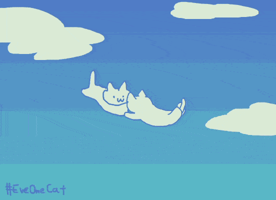

   
    

#### Thanks for visiting :heart:
Counting of visitors to this page in this section started from April 14, 2024
 

 

- 📫 How to reach me **ywye@mail.nwpu.edu.cn**    
- 📒 My interests are model pre-training (modal-specific and paired/unpaired multi-modal pre-training), efficient fine-tuning techniques, and universal model designs.
